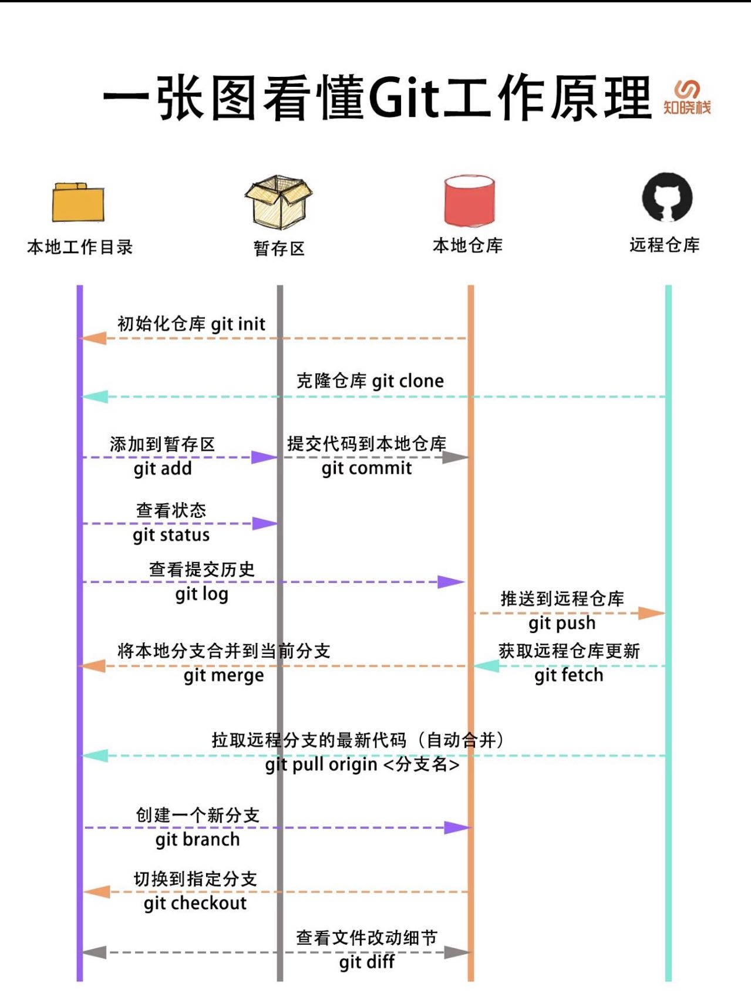
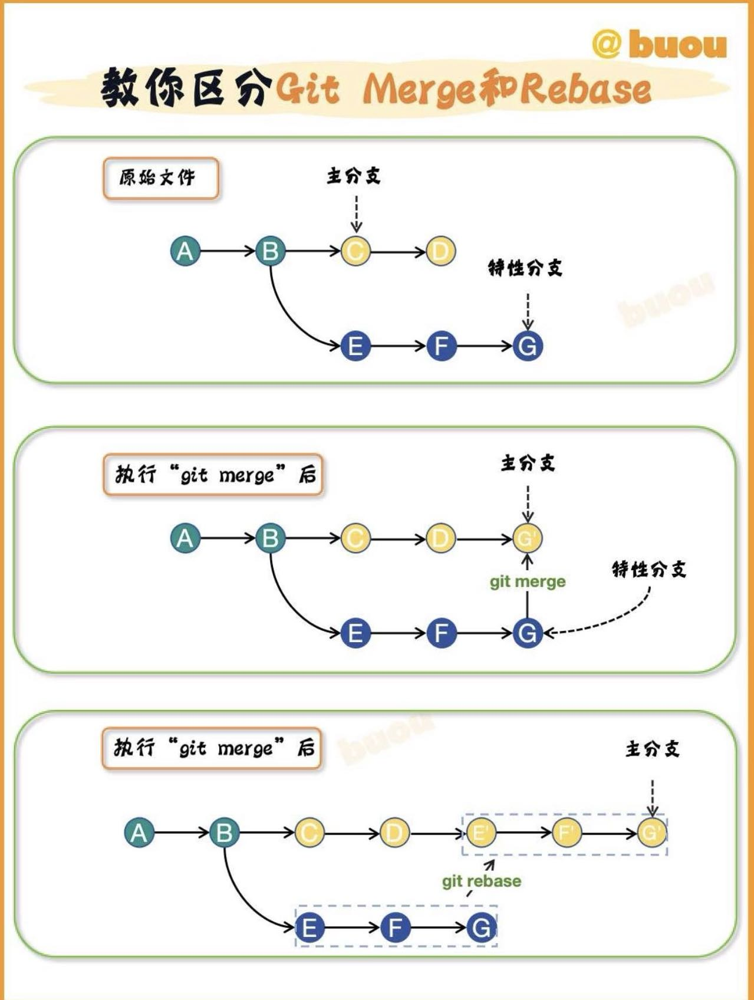

```git

# Git 常用指令大全

## 一、 初始化与配置
# 初始化本地 Git 仓库
git init

# 配置全局用户名
git config --global user.name "你的名字"

# 配置全局邮箱
git config --global user.email "你的邮箱"

# 查看当前的所有配置信息
git config --list

## 二、 常规工作流（增删改查）
# 查看当前工作区和暂存区的状态
git status

# 将指定文件添加到暂存区
git add <file_name>

# 将当前目录下的所有修改添加到暂存区
git add .

# 提交暂存区的内容到本地仓库，并添加提交信息
git commit -m "提交信息"

# 跳过暂存区，直接将已追踪文件的修改提交到本地仓库
git commit -a -m "提交信息"

## 三、 撤销与修改
# 撤销工作区中指定文件的修改（恢复到暂存区或最后一次提交的状态）
git checkout -- <file_name>

# 将指定文件从暂存区移出，但保留工作区的修改
git reset HEAD <file_name>

# 修改最后一次提交的说明（或者追加漏掉的修改）
git commit --amend

## 四、 查看历史与对比
# 查看详细的提交历史记录
git log

# 查看精简版的提交历史（单行显示）
git log --oneline

# 查看指定文件的历史修改记录
git log -p <file_name>

# 对比工作区和暂存区的差异
git diff

# 对比暂存区和最后一次提交的差异
git diff --cached

## 五、 分支管理
# 查看所有本地分支（当前分支前会有 * 号）
git branch

# 查看所有本地分支和远程分支
git branch -a

# 创建一个新分支，但仍留在当前分支
git branch <branch_name>

# 切换到指定分支
git checkout <branch_name>

# 创建并切换到新分支（等价于上面两步）
git checkout -b <branch_name>

# 将指定分支合并到当前分支
git merge <branch_name>

# 删除已合并的本地分支
git branch -d <branch_name>

# 强制删除本地分支（未合并也能删）
git branch -D <branch_name>

## 六、 远程仓库操作
# 克隆远程仓库到本地
git clone <url>

# 查看当前配置的远程仓库别名及地址
git remote -v

# 添加一个新的远程仓库并命名
git remote add <short_name> <url>

# 从远程仓库拉取最新代码并与当前本地分支合并
git pull <remote_name> <branch_name>

# 将本地分支的提交推送到远程仓库
git push <remote_name> <branch_name>

# 第一次推送本地分支到远程，并建立追踪关系
git push -u origin <branch_name>

## 七、 标签管理
# 列出所有标签
git tag

# 在当前提交上创建一个附注标签
git tag -a v1.0 -m "版本说明"

# 将指定标签推送到远程仓库
git push origin <tag_name>

# 将所有本地标签一次性推送到远程仓库
git push origin --tags
```